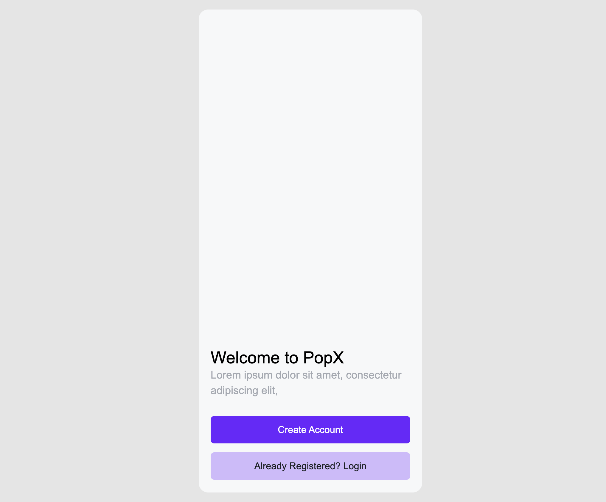
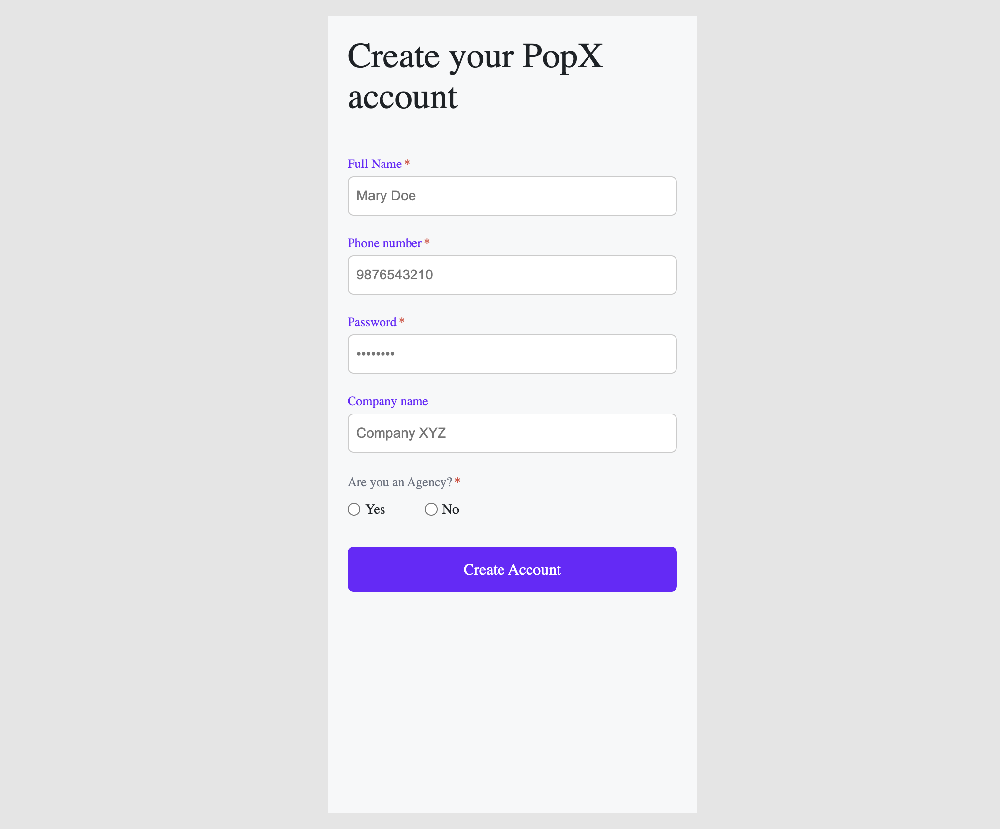
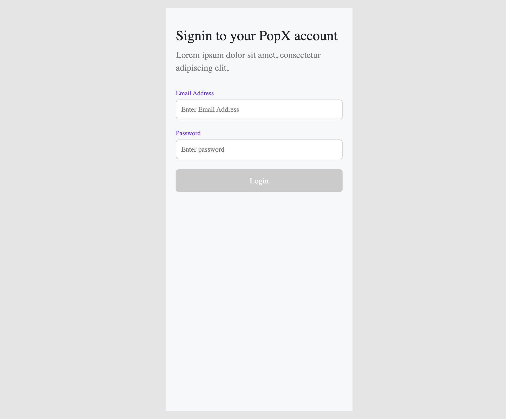

# PopX Mobile App (Demo Version)

PopX is a mobile-style React web application demonstrating user onboarding and profile management with a clean, modern interface.

This is a demo version showcasing:

- Landing Page

- Signup Page

- Login Page

- Profile Page

## Features

- **Landing Page:** Introduction to PopX with navigation to signup/login.
- **Signup Page:** Users can create an account with:

    - Full Name

    - Phone Number

    - Password

    - Company Name

    - Agency Selection (Yes/No)

- **Login Page:** Users can login using email and password.

- **Profile Page:**

    - Display user info: name, email, phone, company, agency status

    - Profile picture with option to change

    - Logout button
## Technologies Used

- React (Vite)

- React Router DOM

- HTML, CSS (inline styling)

- JavaScript (ES6+)
## Running the Project Locally

- **Clone the repository:** 
```
git clone git clone https://github.com/Amie2002/PopX-Mobile-App.git
```
- **Install dependencies:**
```
cd PopX-Mobile-App
cd my-first-react
npm install
```
- **Start the development server:** 
```
npm run dev
```
- Open your browser at http://localhost:5173 (Vite default port).
## Build for Production
```
npm run build
```
- Production-ready files will be in the dist/ folder.

- Can be deployed to Netlify, Vercel, GitHub Pages, etc.
## Live Demo

- [Netlify Link](https://68ab448be9665c01722ffab1--popx-mobileapp.netlify.app)
## Screenshots

- **Landing Page**



- **Signup Page**



- **Login Page**



- **Profile Page**


## License

This project is for demo purposes only.

